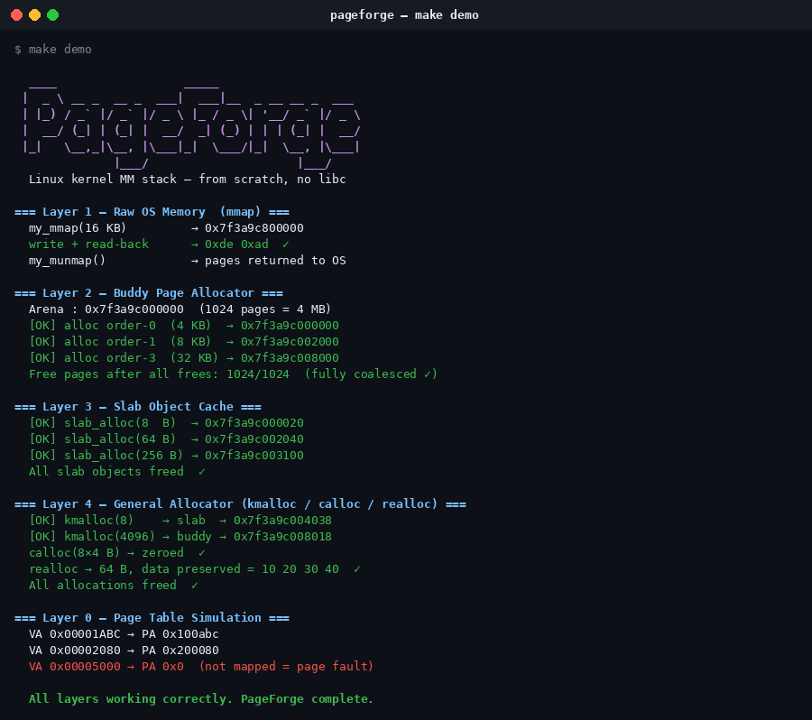
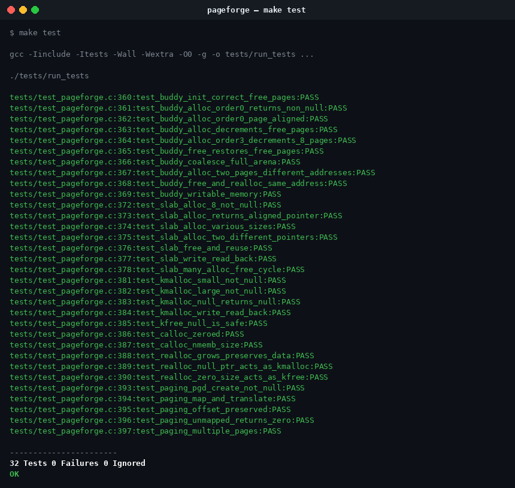

# PageForge: Linux Kernel Memory Management — From Scratch


A ground-up implementation of the **Linux kernel memory management stack** in C — no libc, no stdlib, no cheating. Every layer is hand-built: raw `mmap` syscalls, a buddy page allocator, a slab object cache, and a `kmalloc`/`kfree`/`calloc`/`realloc` general allocator — all validated with 32 Unity unit tests and runnable under QEMU user-mode emulation.

This project is a practical deep-dive into Chapter 12 & 15 of *Linux Kernel Development* (Robert Love, 3rd ed.), translated into working, testable C code.

---

## The 5 Layers

```
  User / Kernel Code
       │
       ▼
┌─────────────────────────────────┐
│  Layer 4 — General Allocator    │  kmalloc / kfree / calloc / realloc
│  (my_alloc.c)                   │  routes to slab (≤1 KB) or buddy (>1 KB)
├─────────────────────────────────┤
│  Layer 3 — Slab Allocator       │  8 fixed-size caches: 8 B … 1024 B
│  (my_slab.c)                    │  embedded free-list, magic-number guards
├─────────────────────────────────┤
│  Layer 2 — Buddy Page Allocator │  1024 pages / 4 MB arena, order 0–10
│  (my_buddy.c)                   │  XOR-buddy coalescing, O(log N) alloc
├─────────────────────────────────┤
│  Layer 1 — Raw OS Memory        │  mmap / munmap via inline syscall
│  (my_syscall.c)                 │  zero libc dependency
├─────────────────────────────────┤
│  Layer 0 — Page Table Sim       │  two-level page directory (x86 style)
│  (my_paging.c)                  │  VA→PA translation, PTE flags
└─────────────────────────────────┘
```

---

## Demo Output



---

## Unit Tests — 32/32 Passing



---

## Project Structure

```
PageForge/
├── .github/
│   └── workflows/
│       └── ci.yml              # GitHub Actions: build + test + QEMU + valgrind
├── .gitignore
├── Dockerfile                  # Reproducible Ubuntu 22.04 build environment
├── Makefile
├── MEMORY_MANAGEMENT.md        # 200-page deep-dive into Linux MM concepts
├── README.md
├── assets/
│   ├── demo_output.png         # Terminal screenshot of make demo
│   └── test_output.png         # Terminal screenshot of make test
├── demo/
│   └── demo.c                  # Standalone colorful demo of all 5 layers
├── include/
│   ├── my_alloc.h
│   ├── my_buddy.h
│   ├── my_io.h
│   ├── my_paging.h
│   ├── my_slab.h
│   ├── my_syscall.h
│   └── my_types.h              # Custom stdint-style types, no libc
├── src/
│   ├── main.c                  # Entry point for the static binary
│   ├── my_alloc.c              # kmalloc / kfree / calloc / realloc
│   ├── my_buddy.c              # Buddy page allocator
│   ├── my_io.c                 # my_printf / my_puts (no stdio)
│   ├── my_paging.c             # Two-level page table simulation
│   ├── my_slab.c               # Slab object cache
│   └── my_syscall.c            # Raw mmap/munmap/write/exit syscalls
└── tests/
    ├── test_pageforge.c        # 32 Unity tests across all layers
    └── vendor/
        └── unity/              # Unity test framework (ThrowTheSwitch)
```

---

## Technology Stack

| Category         | Tool / Standard                          |
| :--------------- | :--------------------------------------- |
| Language         | C (C11)                                  |
| Build System     | GNU Make                                 |
| Testing          | Unity (ThrowTheSwitch)                   |
| Memory Debugging | Valgrind                                 |
| Emulation        | QEMU user-mode (`qemu-x86_64-static`)    |
| CI/CD            | GitHub Actions                           |
| Environment      | Docker (Ubuntu 22.04)                    |
| Reference        | *Linux Kernel Development*, Robert Love  |

---

## How to Build

### Docker (Recommended — matches CI exactly)

```bash
# Build the image
docker build -t pageforge-dev .

# Run build + all tests + demo + QEMU (default CMD)
docker run --rm pageforge-dev

# Interactive shell inside the container
docker run --rm -it pageforge-dev bash
```

### Native (Linux)

```bash
# Prerequisites
sudo apt install build-essential gcc make valgrind qemu-user-static

# Build the static binary
make

# Run it natively
make run

# Run under QEMU x86_64 user-mode
make qemu
```

---

## How to Run the Tests

```bash
make test
```

```
tests/test_pageforge.c:360:test_buddy_init_correct_free_pages:PASS
tests/test_pageforge.c:361:test_buddy_alloc_order0_returns_non_null:PASS
...
tests/test_pageforge.c:397:test_paging_multiple_pages:PASS

-----------------------
32 Tests 0 Failures 0 Ignored
OK
```

**Test coverage:**

| Group             | Tests | What's verified                                                 |
| :---------------- | :---: | :-------------------------------------------------------------- |
| Buddy Allocator   |  10   | init, alloc/free, page alignment, coalescing, writable memory   |
| Slab Allocator    |   7   | alloc/free, alignment, reuse, 100-cycle stress                  |
| General Allocator |  10   | kmalloc, kfree(NULL), calloc zeroing, realloc data preservation |
| Paging            |   5   | pgd create, VA→PA translation, offset, unmapped fault           |

---

## How to Run the Demo

```bash
make demo
```

The demo walks through all five layers with live addresses and pass markers:

- **Layer 1** — `my_mmap(16 KB)` → write → read-back → `my_munmap`
- **Layer 2** — buddy alloc order-0/1/3 → free → full coalesce verified
- **Layer 3** — slab alloc 8 B / 16 B / 64 B / 256 B → free
- **Layer 4** — `kmalloc`, `calloc` (zeroed), `realloc` (data preserved), `kfree`
- **Layer 0** — page table: map 3 pages, VA→PA translation, unmapped fault

---

## Key Concepts Implemented

### Buddy Allocator (Linux `alloc_pages` equivalent)

- Arena of **1024 pages (4 MB)** managed as a binary buddy tree
- `my_alloc_pages(order)` — allocates 2^order contiguous pages
- `my_free_pages(ptr, order)` — frees and coalesces with XOR-buddy formula:
  ```c
  buddy_idx = page_idx ^ (1 << order);
  ```
- Free lists per order (`g_buddy.free[MAX_ORDER]`), O(log N) allocation

### Slab Allocator (Linux `kmem_cache` equivalent)

- **8 fixed-size caches**: 8, 16, 32, 64, 128, 256, 512, 1024 bytes
- Each slab page holds an embedded free-list of objects
- Magic number guard (`0x51AB1234`) detects header corruption on every alloc/free
- Memory poisoned with `0xDEADDEAD` on free to catch use-after-free

### General Allocator (Linux `kmalloc` equivalent)

- Sizes ≤ 1024 B → routed to slab cache
- Sizes > 1024 B → routed directly to buddy allocator
- Magic number (`0xA110C8ED`) in each allocation header
- `my_calloc` — allocates + zero-fills
- `my_realloc` — allocates new, copies old data, frees old block
- `my_kfree(NULL)` — safe no-op

### Page Table Simulation (x86 two-level)

- Page Directory (1024 entries) + Page Tables (1024 entries each)
- `PD_INDEX(va) = (va >> 22) & 0x3FF`
- `PT_INDEX(va) = (va >> 12) & 0x3FF`
- PTE flags: `PTE_PRESENT`, `PTE_WRITE`, `PTE_USER`
- `my_virt_to_phys(pgd, va)` — returns 0 for unmapped addresses (page fault)

---

## Documentation

A detailed, 200-page write-up is included in [`MEMORY_MANAGEMENT.md`](MEMORY_MANAGEMENT.md) covering:

- Why memory management is the hardest part of an OS kernel
- Physical memory, zones (DMA / NORMAL / HIGHMEM), `struct page`
- `alloc_pages` GFP flags (Tables 12.3–12.7 from the book)
- Buddy system algorithm — splitting and coalescing with proof
- Slab allocator internals — caches, slabs, objects, partial/full/empty states
- Virtual memory, VMA (`vm_area_struct`), `mmap` internals
- x86 two-level and four-level page table walk
- PageForge source walkthrough — every function explained
- QEMU user-mode setup and cross-architecture testing

---

## Valgrind

```bash
valgrind --leak-check=full ./demo/pageforge_demo
# Expected: 0 errors, 0 leaks
```

---

## License

MIT — see [LICENSE](LICENSE) for details.
